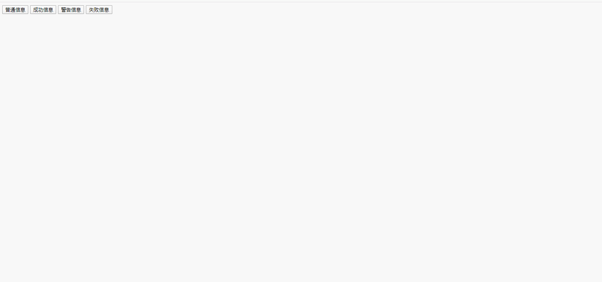

### pc端 message 消息提示插件

> 利用 原生js

### 说明
	1. 仿照 Element-ui 的message组件 做的一个原生js的提示信息小插件
	2. 一共有四种不同状态 用来显示「成功、警告、消息、错误」类的操作反馈。
	3. 可以自定义是否自动关闭
	4. 也可以设置手动关闭按钮

### 参数说明

```js
            message: '', // 要提示的消息
            type: 'info', // 信息类型 一共四种类型「info(默认)、success、warning、error」不传默认 info
            auto: true, // 自动关闭 默认自动
            showClose: false, // 关闭按钮 默认无
            duration: 3000, // 过渡时间 默认3000
            oninit: function() {}, // 初始回调
            onopen: function() {}, // 打开状态回调
            onclose: function() {} // 关闭状态回调
```

### 调用说明

```js

    1. 直接调用

         tips('哈哈哈哈哈哈！');
    
    2. 传入参数    

        tips({
            message: "成功信息成功信息成功信息",
            type: "success",
			auto: false,
			showClose:true,
			onclose: function() {
				console.log('我关闭啦！');
			}
        });
```

### 预览


